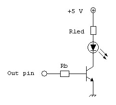
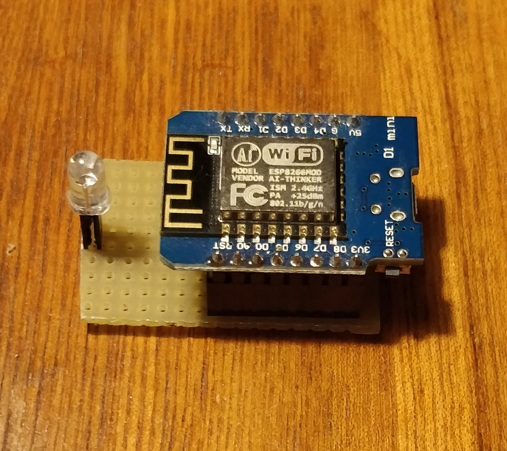

# RESTful IR Sony TV remote

This is a RESTful server made on Wemos D1 mini board for controlling via IR led a Sony TV.

## Description

The systems acts like a RESTful server that expose api. Every command can be sent using a `PUT` request.
The `GET` at the uri `/remotes` return, in json format, all the commands available.
The `PUT` at every uri like `/remotes/COMMAND` (COMMAND is one of the commands retrive by the `GET` at `/remotes`) make the send of ir command

Every time it boots it search the SSID and the password of the WiFi network to which connect in the EEPROM.
In the case of first boot it doesn't find anything (at the same mode everytime it doesn't find the saved network), so it make a self network, named "Tv remote" and with the password "TV_REMOTE". It can be used in this way (without a internet or WiFi connection), or it can be possibile to upload the new parameter for the WiFi connection (check the end of the main page).
When it connects to a WiFi network it takes the static IP "192.168.1.200", with the netmask "255.255.255.0" (the same as /24) and the gateway "192.168.1.1". It can be possible to edit these configuration in the source.

## Prerequisites

In order to use correctly this project the `ESP8266WebServer` library need some mods.
The library is located, in case of using PlatformIO IDE through Atom.io, under the folder `HOME:/.platformio/packages/framework-arduinoespressif8266/libraries/ESP8266WebServer`

The file to be modified is `src/detail/RequestHandlerImpl.h`

- We had to add the private method that implements a comparation between Strings based on wildcards (? and *).
  We use the method found here https://www.codeproject.com/Articles/1088/Wildcard-string-compare-globbing, thanks to Jack Handy

  After
```c++
      protected:
        ESP8266WebServer::THandlerFunction _fn;
        ESP8266WebServer::THandlerFunction _ufn;
        String _uri;
        HTTPMethod _method;
```
  Add the method in the page as `private`.

- Change the simple equality with the comparision made with that method. In order to not overhead the system in case of not wildcard, is used the old method.
  Comment this part:
```c++
      if (requestUri != _uri)
        return false;
```

  And add:
```c++
      if(_uri.indexOf('*') == -1 && _uri.indexOf('?') == -1) {
        if(requestUri != _uri)
          return false;
        }
          else {
            return wildcmp(&(_uri[0]), &(requestUri[0]));
        }
```

## Hardware configuration

The hardware configuration is very simple: it consits in a IR led connected with a resistor to the pin declared in the sketch:
```c++
#define IR_SEND_PIN 4
```
I need the led driven by more current, so I use a little more complex configuration, with a NPN transistor (I use BC547) driven by the output pin declared and driving the IR led.



I use a R<sub>b</sub>=1000 ohm and a R<sub>led</sub>=35 ohm (a trimmer).

### Implementation

Here there are some images that represents how I mount the components.
<table>
  
  &nbsp;&nbsp;&nbsp;
  
</table>

## How to obtain codes for your TV

If you have a Sony TV probably most of the codes I insert are good for you.</br>
If you want to use codes from your remote you can use an IR receiver and upload the [IrRecvDumpV2](https://github.com/markszabo/IRremoteESP8266/blob/master/examples/IRrecvDumpV2/IRrecvDumpV2.ino) and write down every code you need. Then if your TV is not a Sony you have to change the
```c++
  irsend.sendSony(command, 12);
```
line with the correct `sendX()` from `irsend`.

## License

This project is licensed under the GPLv3 License - see the [LICENSE](LICENSE) file for details
